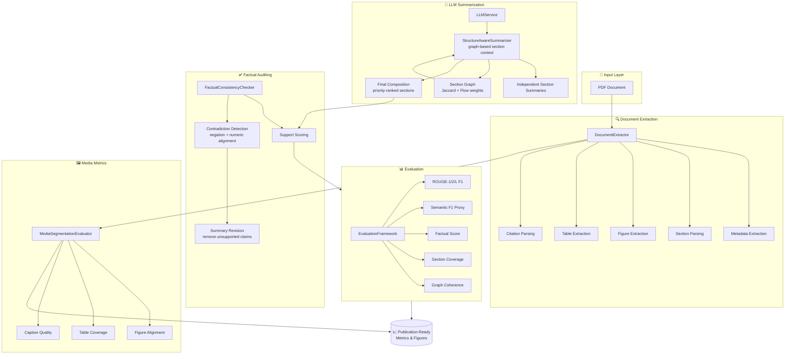

# Research Paper Summarizer

[](https://python.org)
[](https://streamlit.io)
[](LICENSE)

A **research-grade scientific document summarization system** that converts academic PDFs into structured, evidence-aware summaries with section-level breakdowns, citation-aware media alignment, and factual consistency auditing. Built for rigorous evaluation and deployment.

---

## Table of Contents

- [Architecture](#architecture)
- [Pipeline Workflow](#pipeline-workflow)
- [Features](#features)
- [Results & Metrics](#results--metrics)
- [Getting Started](#getting-started)
- [Deployment](#deployment)
- [Project Structure](#project-structure)

---

## Architecture

The system is organized as a modular pipeline with four core stages:



---

## Pipeline Workflow

The end-to-end flow processes a PDF through extraction → summarization → auditing → evaluation:

```
┌──────────────────────────────────────────────────────────────────────────┐
│                        1. DOCUMENT EXTRACTION                           │
│                                                                          │
│   PDF ──► PyMuPDF ──► Line Items ──► Metadata (title/authors/year)      │
│              │              │                                            │
│              ▼              ▼                                            │
│         Figures ◄──► Sections ──► Section Graph (Jaccard + Flow)        │
│              │              │                                            │
│              ▼              ▼                                            │
│          Tables        Citations (numbered + author regex)              │
└──────────────────────────────────────────────────────────────────────────┘
                                    │
                                    ▼
┌──────────────────────────────────────────────────────────────────────────┐
│                     2. LLM SUMMARIZATION                                │
│                                                                          │
│   Backends: Groq API │ Ollama │ Local GGUF (llama.cpp)                  │
│                                                                          │
│   For each section (priority-ranked):                                    │
│     ┌─────────────────────────────────────────────┐                     │
│     │  Section Text + Graph Context (linked secs)  │                     │
│     │           + Domain Adaptation                │                     │
│     └───────────────────┬─────────────────────────┘                     │
│                         ▼                                               │
│              ┌────────────────────┐                                     │
│              │   LLM Generate     │  ← retry with shrinking context     │
│              └────────┬───────────┘                                     │
│                       ▼                                                 │
│              Section Summary (cached)                                   │
│                                                                          │
│   Compose Final: priority-rank sections → single coherent summary      │
└──────────────────────────────────────────────────────────────────────────┘
                                    │
                                    ▼
┌──────────────────────────────────────────────────────────────────────────┐
│                   3. FACTUAL AUDITING & REVISION                        │
│                                                                          │
│   For each summary sentence:                                             │
│     ┌──────────────────────────────────────────────────┐                │
│     │  Find best-supporting source sentence             │                │
│     │    = 0.65 × Jaccard + 0.35 × Cosine Similarity   │                │
│     │                                                  │                │
│     │  Check for contradictions:                       │                │
│     │    • Negation mismatch (e.g. "is" vs "is not")    │                │
│     │    • Numeric mismatch (e.g. "75%" vs "25%")       │                │
│     │                                                  │                │
│     │  Score < threshold or contradiction?  ──► Flag   │                │
│     └──────────────────────────────────────────────────┘                │
│                                                                          │
│   Revise: Remove flagged sentences from summary                         │
└──────────────────────────────────────────────────────────────────────────┘
                                    │
                                    ▼
┌──────────────────────────────────────────────────────────────────────────┐
│                      4. EVALUATION & OUTPUT                             │
│                                                                          │
│   ┌─────────────────────────────────────────────────────────┐           │
│   │  ROUGE-1 F1  │  ROUGE-2 F1  │  ROUGE-L F1               │           │
│   │  Semantic F1 │  Factual Score│  Section Coverage         │           │
│   │  Graph Coherence │ Media Score│  Runtime                 │           │
│   └─────────────────────────────────────────────────────────┘           │
│                                                                          │
│   Outputs: JSON results, CSV tables, LaTeX tables, PNG figures          │
│   Streamlit Dashboard: interactive section browsing, comparison,        │
│                         survey synthesis, citation gallery              │
└──────────────────────────────────────────────────────────────────────────┘
```

---

## Features

### 1. Document Extraction (`pipeline.py:DocumentExtractor`)
- **Metadata inference** — title, authors, year from PDF metadata or text heuristics
- **Section parsing** — regex-based heading detection using font size, boldness, numbering patterns
- **Figure/table extraction** — PyMuPDF image rects + `find_tables()`
- **Citation parsing** — numbered `[1]` and author-name strategies
- **Running header/footer removal** — frequency-based filtering
- **Section graph construction** — Jaccard similarity + positional flow weights

### 2. LLM Summarization (`pipeline.py:LLMService`)
- **Multiple backends**: Groq API, Ollama, local GGUF (llama.cpp)
- **Automatic provider detection**: Groq → Ollama → local fallback
- **Retry with shrinking context window** — gracefully handles token limits
- **Fallback summarizer** — extractive sentence selection when LLM unavailable
- **Section-aware composition** — priority-ranked section selection

### 3. Structure-Aware Summarization (`research_experiment_framework.py:StructureAwareSummarizer`)
- **Section importance scoring** — priority map (Abstract=1.0, Method=0.95, Results=1.0, etc.)
- **Graph-informed context** — top-3 linked sections provide context for each summary
- **Priority-ranked final composition** — top-N sections by importance score

### 4. Factual Consistency Auditing (`research_experiment_framework.py:FactualConsistencyChecker`)
- **Support scoring** — weighted Jaccard + Cosine similarity per sentence
- **Contradiction detection** — negation polarity flips, numeric mismatches
- **Summary revision** — removes flagged unsupported sentences

### 5. Multi-Document Analysis
- **Comparative analysis** — side-by-side paper comparison across 6 dimensions
- **Survey synthesis** — thematic grouping, idea evolution, open problems
- **Cross-paper trend extraction** — yearly distribution, common keywords

### 6. Media Segmentation Evaluation (`research_experiment_framework.py:MediaSegmentationEvaluator`)
- Figure/table coverage, caption quality, alignment with sections
- Composite `phase2_media_score` (6 weighted sub-metrics)

### 7. Domain Adaptation
- Auto-detects `medical`, `legal`, `govt`, or `general` domains
- Domain-specific summarization instructions

### 8. Interactive Web App (`app.py`)
- **Paper Analysis tab** — metadata card, section-by-section browsing with original vs summary side-by-side
- **Comparative tab** — overview table + AI-generated cross-paper analysis
- **Survey tab** — thematic survey synthesis across multiple papers
- **Citations tab** — expandable reference lists per paper
- **Figures & Tables tab** — cropped figure gallery + table previews

---

## Results & Metrics

### Quantitative Results (Longformer paper experiment)

| Metric | Baseline | Structure-Aware | Fact-Checked | Δ Improvement |
|--------|----------|----------------|--------------|:---:|
| **ROUGE-1 F1** | 0.1277 | 0.1346 | 0.1346 | +5.4% |
| **ROUGE-2 F1** | 0.0483 | 0.0957 | 0.0957 | **+98.1%** |
| **ROUGE-L F1** | 0.0747 | 0.0832 | 0.0832 | +11.4% |
| **Semantic F1 Proxy** | 0.4532 | 0.5650 | 0.5650 | **+24.7%** |
| **Factual Consistency** | 0.3235 | 0.5022 | 0.5022 | **+55.2%** |
| **Section Coverage** | 0.60 | 0.80 | 0.80 | **+33.3%** |
| **Graph Coherence** | 0.0000 | 0.1663 | 0.1663 | — |
| **Phase2 Media Score** | 0.0000 | — | 0.4875 | — |
| **Runtime (sec)** | 151.5 | 237.1 | 237.1 | +56.5% |

Key insight: the structure-aware approach yields **98% better ROUGE-2**, **25% better semantic similarity**, and **55% better factual consistency** — at the cost of ~85s additional runtime.

### Metric Comparison — Baseline vs Structure-Aware


### Radar Comparison


### Quality vs Runtime Tradeoff


### Section-Level Delta Heatmap


### Section Relation Graph


### Media Assignment by Section


### Section-Level Win Count


### Pipeline Workflow


---

## Getting Started

### Prerequisites

- Python 3.12
- pip
- (Optional) [Ollama](https://ollama.ai) for local LLM inference
- (Optional) [Groq API key](https://console.groq.com) for cloud LLM

### Installation

```bash
# Clone the repository
git clone https://github.com/yourusername/research-paper-summarizer
cd research-paper-summarizer

# Install dependencies
pip install -r requirements.txt
```

### Configuration

Set one of these LLM backends (or let it auto-detect):

```bash
# Option A: Groq API (fastest)
export GROQ_API_KEY="your-key-here"

# Option B: Ollama (local)
export OLLAMA_BASE_URL="http://localhost:11434"
export OLLAMA_MODEL="llama3.2:3b"

# Option C: Local GGUF (no external deps)
# Place a .gguf file at models/llama-3.2-1b-instruct.Q4_K_M.gguf
```

### Run the Streamlit App

```bash
streamlit run app.py
```

Upload one or more PDFs via the sidebar, then explore the interactive tabs.

### Run the Experiment Pipeline

```bash
python run_research_experiments.py
```

This processes the sample paper `data/2004.05150v2.pdf` and outputs comparison metrics, JSON results, and publication-ready tables.

### Run the Notebook

```bash
jupyter notebook research_paper_novelty_experiments.ipynb
```

---

## Deployment

### Streamlit Cloud

1. Push to GitHub
2. Connect repo at [share.streamlit.io](https://share.streamlit.io)
3. Add secrets: `GROQ_API_KEY`, `OLLAMA_BASE_URL`, `OLLAMA_MODEL`

### Docker (GROBID only)

```bash
docker-compose up -d  # Starts GROBID on port 8070
```

---

## Sample Output

### Structured Summary (from `Structured_Summary.txt`)

```
Title: Longformer: The Long-Document Transformer
Authors: Iz Beltagy*, Matthew E. Peters*, Arman Cohan* (2020)

Research Question / Objective:
  Transformer-based models cannot process long sequences due to quadratic
  self-attention. Longformer introduces an attention mechanism that scales
  linearly with sequence length.

Methodology:
  Combines sliding window attention with global attention on task-specific
  tokens. Pretrained on 3.7B tokens with progressive sequence length
  training (2,048 → 23,040 tokens).

Key Results:
  - Outperforms RoBERTa on all long-document tasks
  - New SOTA on WikiHop and TriviaQA
  - 8x longer context than BERT-base at similar compute

Limitations / Future Work:
  Custom CUDA kernel required (not directly supported by PyTorch).
```

### JSON Experiment Results

See `research_experiment_results.json` for full baseline vs structure-aware comparison metrics, including ROUGE scores, factual consistency, section coverage, and graph coherence.

---

## Project Structure

```
├── app.py                                    # Streamlit dashboard
├── pipeline.py                               # Core pipeline (DocumentExtractor, LLMService)
├── research_experiment_framework.py          # Research evaluation framework
├── run_research_experiments.py               # Experiment entry point
├── research_paper_novelty_experiments.ipynb  # Jupyter experiments
├── research_paper_summarizer.ipynb           # Original notebook
├── requirements.txt                          # Python dependencies
├── docker-compose.yml                        # GROBID service
├── data/
│   └── 2004.05150v2.pdf                      # Sample arXiv paper
├── outputs/
│   ├── tables/                               # Publication-ready CSV & LaTeX
│   │   ├── publication_main_metrics.csv
│   │   ├── publication_delta_metrics.csv
│   │   ├── section_level_ablation.csv
│   │   ├── section_relation_adjacency.csv
│   │   └── media_section_incidence.csv
│   └── figures/                              # Generated evaluation figures
│       ├── publication_pipeline_workflow.png
│       ├── publication_metric_bar.png
│       ├── publication_radar_comparison.png
│       ├── publication_quality_runtime_tradeoff.png
│       ├── publication_section_relation_graph.png
│       ├── publication_media_section_graph.png
│       ├── section_level_delta_heatmap.png
│       └── section_level_win_count.png
├── streamlit_app/                            # Standalone Streamlit deployment
│   ├── app.py
│   ├── pipeline.py
│   └── requirements.txt
├── models/                                   # GGUF model files (gitignored)
└── research_experiment_results.json          # Full experiment output
```

---

## Research Contributions

This project includes research-ready components for evaluating summarization quality and media-aware document understanding:

- **Reproducible experimentation** — `research_paper_novelty_experiments.ipynb` + `run_research_experiments.py`
- **Publication-ready outputs** — `outputs/tables/` contains CSV and LaTeX tables for metrics and ablation analysis
- **8 evaluation figures** — bar charts, radar plots, heatmaps, relation graphs, workflow diagrams
- **Phase 2 Media Metrics** — figure/table coverage, alignment, caption quality, density scoring
- **Human evaluation template** — included in experiment output for manual review

---

## Technology Stack

| Component | Technology |
|-----------|-----------|
| PDF Parsing | PyMuPDF (fitz) |
| LLM Backends | Groq API, Ollama, llama.cpp (GGUF) |
| Web UI | Streamlit |
| Evaluation | ROUGE-1/2/L, Semantic F1 Proxy, Factual Score |
| Media Extraction | PyMuPDF image rects + `find_tables()` |
| Infrastructure | Docker (GROBID), Streamlit Cloud |
