# Research Paper Summarizer

[](https://python.org)
[](https://streamlit.io)
[](https://groq.com)
[](LICENSE)

An **end-to-end AI-powered system** that ingests academic PDFs, extracts structured content, generates section-level summaries via LLMs, audits factual consistency, and produces publication-ready metrics — all through an interactive Streamlit dashboard.

---

## Table of Contents

- [Overview](#overview)
- [Architecture](#architecture)
- [Workflow](#workflow)
- [Screenshots](#screenshots)
- [Key Features](#key-features)
- [Technical Outcomes](#technical-outcomes)
- [Technology Stack](#technology-stack)
- [Getting Started](#getting-started)
- [Project Structure](#project-structure)
- [Author](#author)

---

## Overview

Reading and synthesizing research papers is time-consuming. This system automates the process:

1. **Parse** any academic PDF into sections, figures, tables, and citations
2. **Summarize** each section using LLMs (Groq / Ollama / local)
3. **Audit** summaries for factual consistency against the source text
4. **Analyze** multiple papers side-by-side with comparative and survey synthesis
5. **Visualize** results through an interactive multi-tab dashboard

Built for **researchers, students, and professionals** who need to quickly extract insights from scientific literature.

---

## Architecture

The system is organized as a modular pipeline with four core stages:

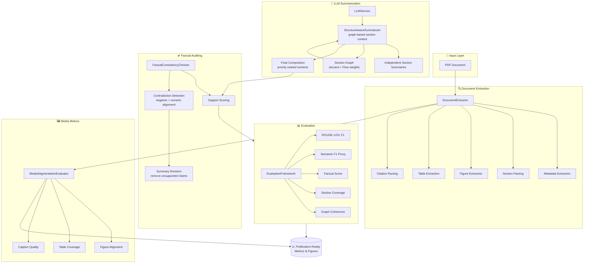

---

## Workflow

The end-to-end pipeline processes a PDF through four stages: **Extraction → Summarization → Auditing → Evaluation**.

### 1. Document Extraction
```
PDF ──► PyMuPDF ──► Line Items ──► Metadata (title/authors/year)
           │              │
           ▼              ▼
      Figures ◄──► Sections ──► Section Graph (Jaccard + Flow)
           │              │
           ▼              ▼
       Tables        Citations (numbered + author regex)
```

### 2. LLM Summarization
Multiple backends supported with automatic fallback: **Groq API → Ollama → Local GGUF (llama.cpp)**. Each section is summarized independently with graph-informed context from linked sections. Priority-ranked composition produces a coherent final summary.

### 3. Factual Auditing
Every summary sentence is scored against the source using weighted **Jaccard + Cosine similarity**. Contradiction detection catches negation flips and numeric mismatches. Unsupportable claims are flagged and removed.

### 4. Evaluation & Output
Generates **ROUGE-1/2/L**, **Semantic F1**, **Factual Score**, **Section Coverage**, and **Graph Coherence** metrics. Output includes JSON results, CSV/LaTeX tables, and PNG figures.

---

## Screenshots

### Dashboard Overview
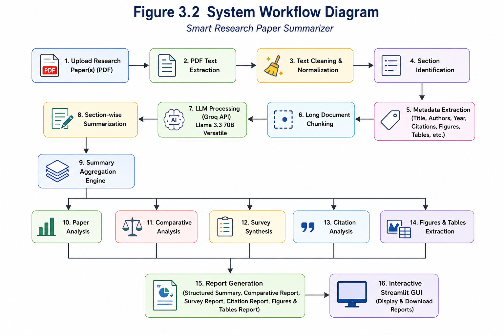

### Paper Analysis — Section-by-section browsing with original vs summary
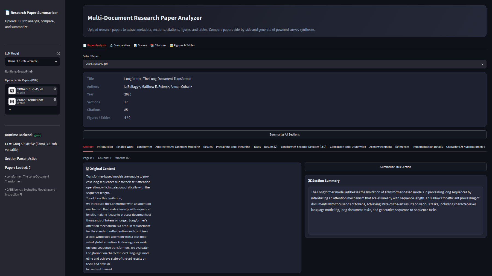

### Comparative Analysis — Side-by-side paper comparison across 6 dimensions
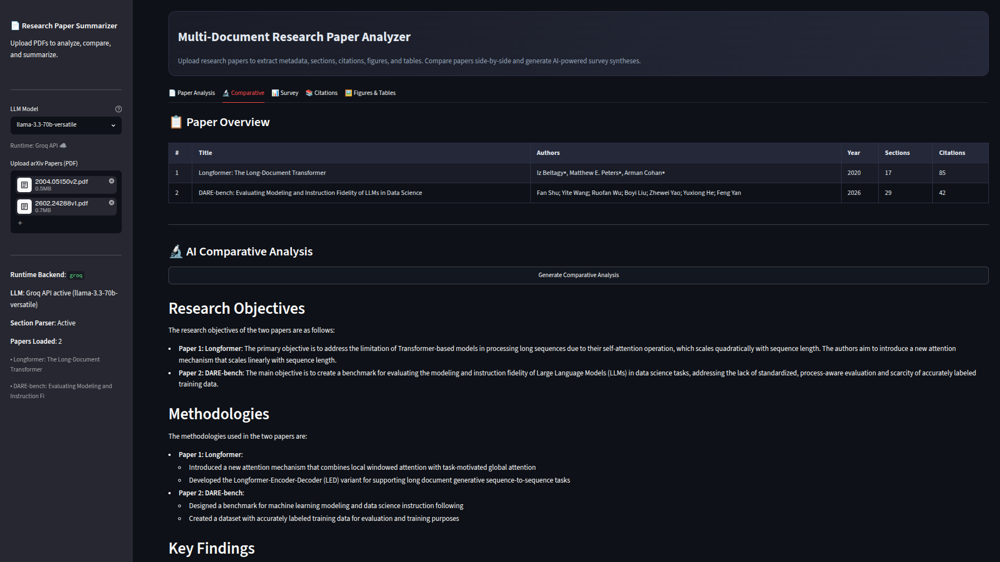

### Survey Synthesis — Thematic grouping and idea evolution
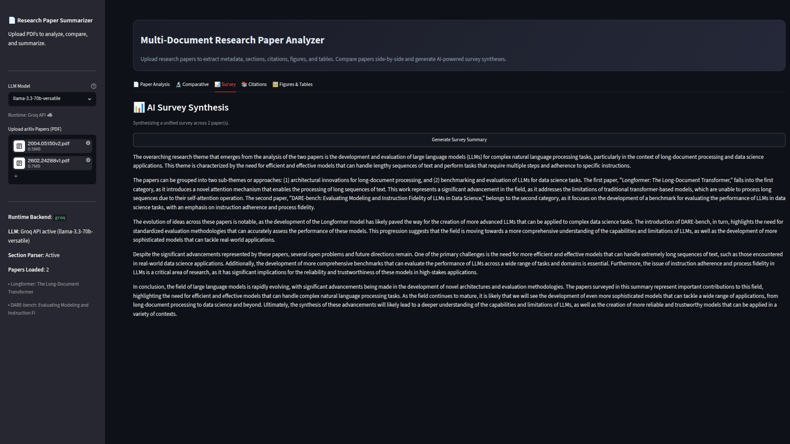

### Citation Gallery — Expandable reference lists per paper
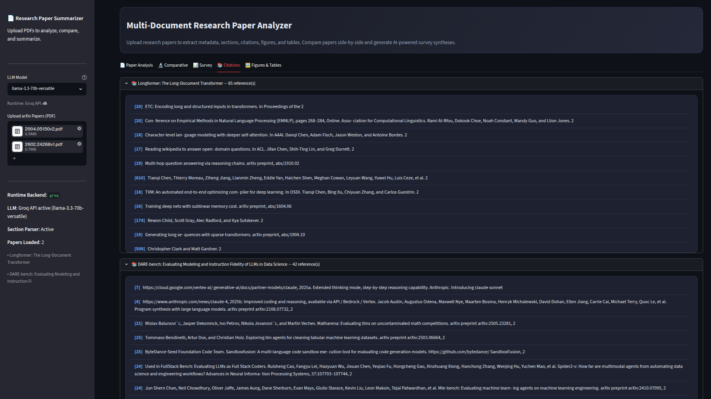

### Figures & Tables — Cropped figure gallery and table previews
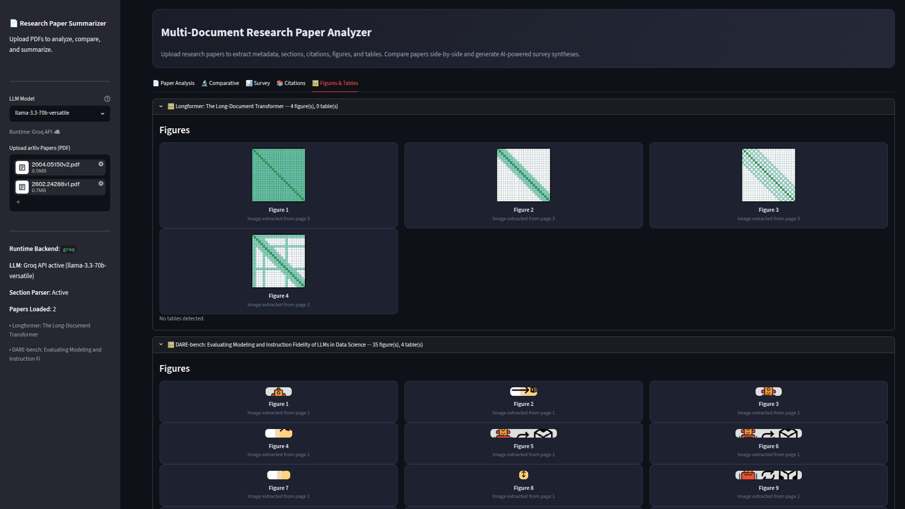

---

## Key Features

### Core Pipeline
- **Document Extraction** — Metadata inference, section parsing, figure/table extraction, citation parsing, running header/footer removal, section graph construction
- **LLM Summarization** — Multiple backends (Groq, Ollama, local GGUF), auto provider detection, retry with shrinking context, extractive fallback summarizer
- **Structure-Aware Summarization** — Section importance scoring, graph-informed context, priority-ranked composition
- **Factual Consistency Auditing** — Support scoring, contradiction detection (negation + numeric), automated summary revision

### Multi-Document Analysis
- **Comparative Analysis** — Side-by-side comparison across 6 dimensions (objectives, methodologies, findings, datasets, strengths, contradictions)
- **Survey Synthesis** — Thematic grouping, idea evolution tracking, open problems identification
- **Cross-paper Trend Extraction** — Yearly distribution, common keyword analysis

### Interactive Dashboard (Streamlit)
- **5 tabs**: Paper Analysis, Comparative, Survey, Citations, Figures & Tables
- Dark mode UI, section-level original-vs-summary view, expandable citation lists, figure gallery with cropped images

### Evaluation Framework
- ROUGE-1/2/L, Semantic F1 Proxy, Factual Score, Section Coverage, Graph Coherence
- Media Segmentation Evaluation (figure/table coverage, caption quality, alignment)
- Publication-ready outputs: CSV tables, LaTeX tables, PNG figures

---

## Technical Outcomes

### Quantitative Results (Longformer paper experiment)

| Metric | Baseline | Structure-Aware | Fact-Checked | Δ Improvement |
|--------|----------|----------------|--------------|:---:|
| **ROUGE-1 F1** | 0.1277 | 0.1346 | 0.1346 | +5.4% |
| **ROUGE-2 F1** | 0.0483 | 0.0957 | 0.0957 | **+98.1%** |
| **ROUGE-L F1** | 0.0747 | 0.0832 | 0.0832 | +11.4% |
| **Semantic F1 Proxy** | 0.4532 | 0.5650 | 0.5650 | **+24.7%** |
| **Factual Consistency** | 0.3235 | 0.5022 | 0.5022 | **+55.2%** |
| **Section Coverage** | 0.60 | 0.80 | 0.80 | **+33.3%** |
| **Graph Coherence** | 0.0000 | 0.1663 | 0.1663 | — |
| **Phase2 Media Score** | 0.0000 | — | 0.4875 | — |
| **Runtime (sec)** | 151.5 | 237.1 | 237.1 | +56.5% |

**Key insight**: The structure-aware approach delivers **98% better ROUGE-2**, **25% better semantic similarity**, and **55% better factual consistency** — at the cost of ~85s additional runtime.

### Evaluation Figures

| Chart | Description |
|-------|-------------|
| 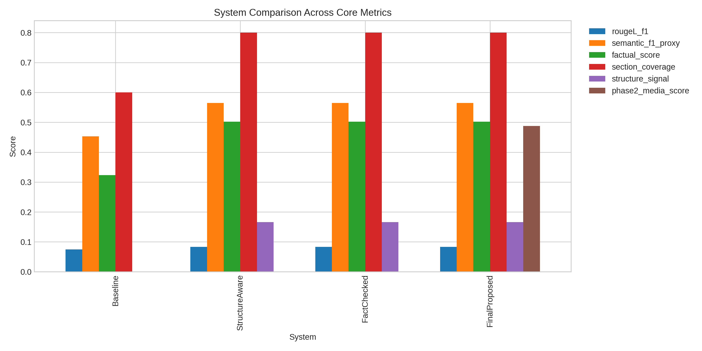 | Metric Comparison — Baseline vs Structure-Aware |
| 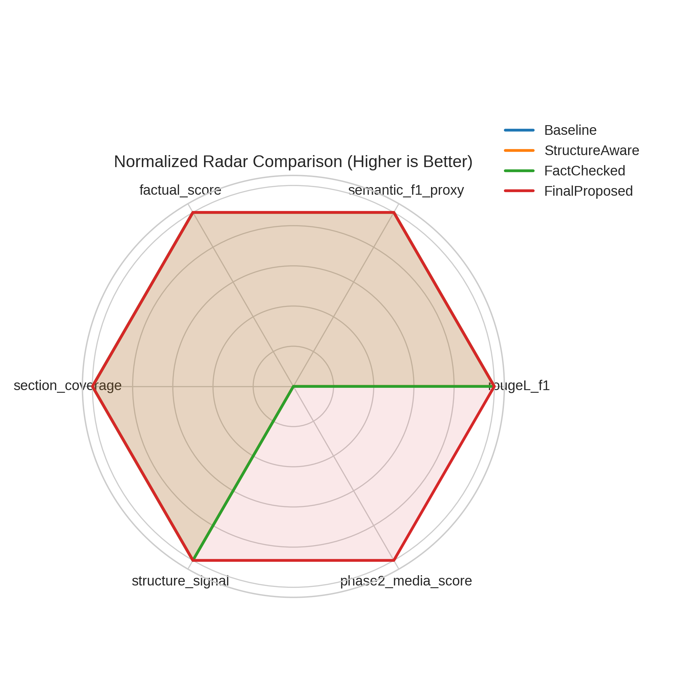 | Radar Comparison across all metrics |
| 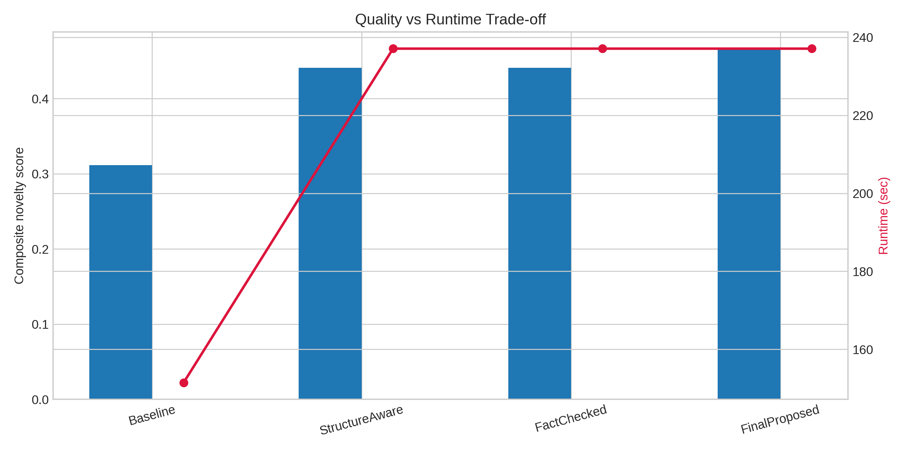 | Quality vs Runtime Tradeoff |
| 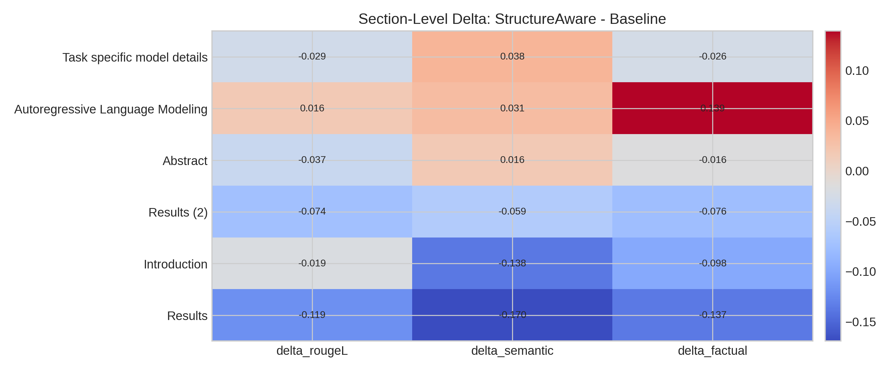 | Section-Level Delta Heatmap |
| 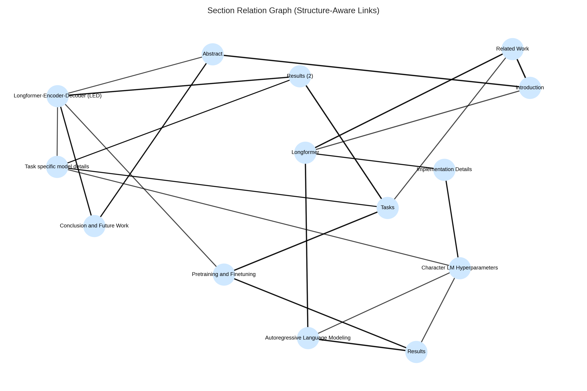 | Section Relation Graph |
| 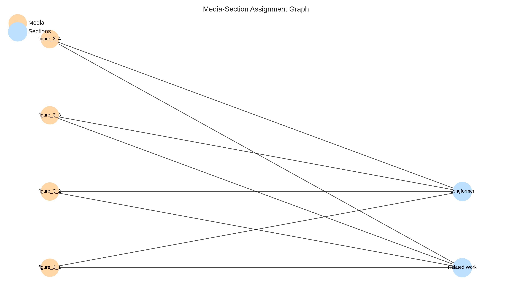 | Media Assignment by Section |
| 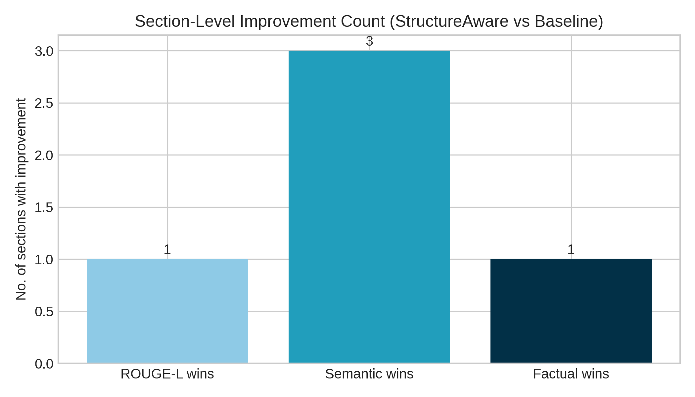 | Section-Level Win Count |
| 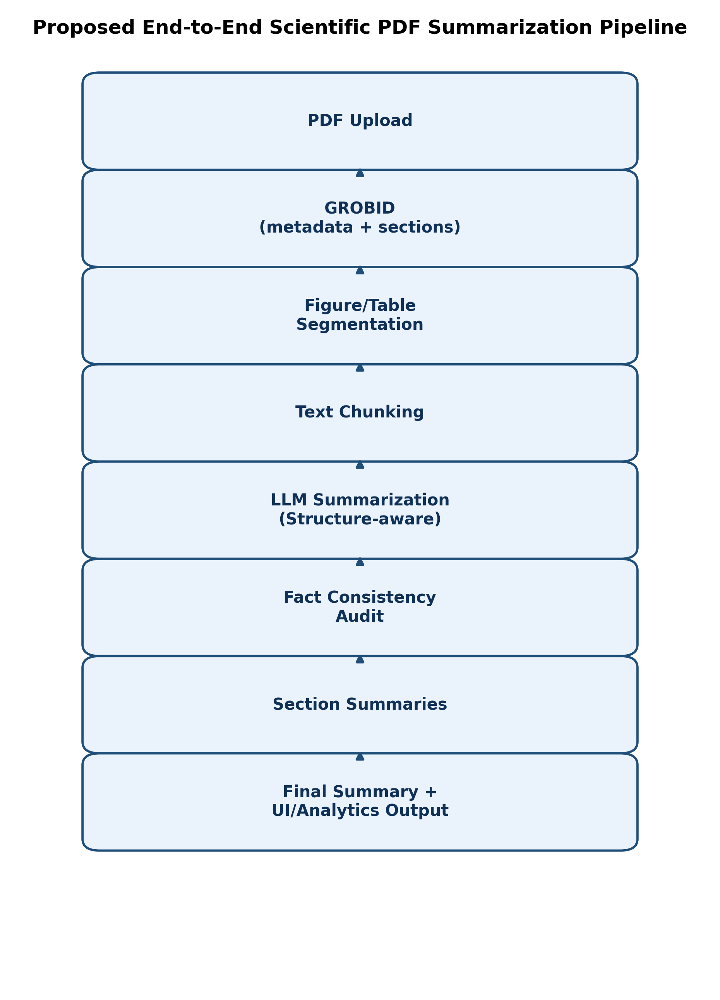 | Pipeline Workflow Diagram |

---

## Technology Stack

| Component | Technology |
|-----------|-----------|
| PDF Parsing | PyMuPDF (fitz) |
| LLM Backends | Groq API, Ollama, llama.cpp (GGUF) |
| Web UI | Streamlit |
| Evaluation | ROUGE-1/2/L, Semantic F1 Proxy, Factual Score |
| Media Extraction | PyMuPDF image rects + `find_tables()` |
| Infrastructure | Docker (GROBID), Streamlit Cloud |

---

## Getting Started

### Prerequisites
- Python 3.12
- pip
- (Optional) [Ollama](https://ollama.ai) for local LLM inference
- (Optional) [Groq API key](https://console.groq.com) for cloud LLM

### Installation

```bash
git clone https://github.com/yourusername/research-paper-summarizer
cd research-paper-summarizer
pip install -r requirements.txt
```

### Configuration

Set one of these LLM backends (or let it auto-detect):

```bash
# Option A: Groq API (fastest)
export GROQ_API_KEY="your-key-here"

# Option B: Ollama (local)
export OLLAMA_BASE_URL="http://localhost:11434"
export OLLAMA_MODEL="llama3.2:3b"

# Option C: Local GGUF (no external deps)
# Place a .gguf file at models/llama-3.2-1b-instruct.Q4_K_M.gguf
```

### Run the App

```bash
streamlit run app.py
```

Upload one or more PDFs via the sidebar, then explore the interactive tabs.

### Run Experiments

```bash
python run_research_experiments.py
```

Processes the sample paper `data/2004.05150v2.pdf` and outputs comparison metrics, JSON results, and publication-ready tables.

---

## Project Structure

```
├── app.py                                    # Streamlit dashboard (5 tabs)
├── pipeline.py                               # Core pipeline (DocumentExtractor, LLMService)
├── research_experiment_framework.py          # Research evaluation framework
├── run_research_experiments.py               # Experiment entry point
├── research_paper_novelty_experiments.ipynb  # Jupyter experiments
├── requirements.txt                          # Python dependencies
├── data/
│   └── 2004.05150v2.pdf                      # Sample arXiv paper
├── outputs/
│   ├── screenshots/                          # Dashboard screenshots (6 images)
│   ├── figures/                              # Generated evaluation figures (8 PNGs)
│   └── tables/                               # Publication-ready CSV & LaTeX
├── streamlit_app/                            # Standalone Streamlit deployment
│   ├── app.py
│   ├── pipeline.py
│   └── requirements.txt
├── models/                                   # GGUF model files (gitignored)
└── research_experiment_results.json          # Full experiment output
```

---

## Author

**Athiyaman M**

---

## License

This project is licensed under the MIT License.
